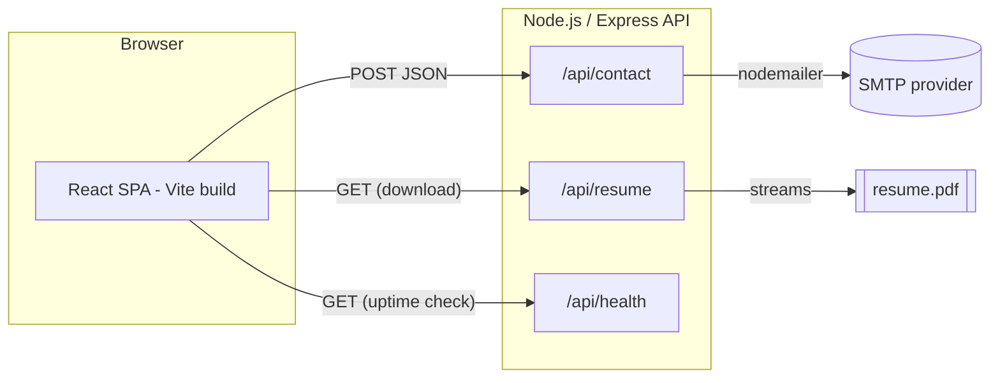

# System Architecture — Mark Jeferson Manalo Portfolio

This document describes the technical architecture of the portfolio site, built to satisfy the
Product Requirements Document in [`docs/PRD.txt`](docs/PRD.txt).

## 1. High-level overview

The project is a **monorepo** with two independently runnable applications, orchestrated from the
root via npm workspaces:

- **`frontend/`** — a React.js (Vite) single-page application. Renders the whole one-page portfolio
  (Hero → About → Skills → Projects → Experience → Contact → Footer) as described in PRD §6.
- **`backend/`** — a Node.js/Express API. Handles the contact form (PRD §6.6), résumé/CV download
  (PRD §6.5), and a health-check endpoint. It does **not** serve HTML — the frontend is a fully
  static SPA that can be deployed independently (e.g. Vercel/Netlify) while the API runs elsewhere
  (e.g. Render/Fly.io/EC2), or both can be served from the same host behind a reverse proxy.



Content (name, bio, skills, projects, experience) is **not** hardcoded into components. It lives in
plain JS data modules under `frontend/src/data/`, matching the PRD's explicit v1 scope: *"CMS/admin
panel... out of scope; content hardcoded or in a simple config file."* This keeps the site
editable without touching component code or standing up a database/CMS.

## 2. Directory structure

```
myportfolio/
├── frontend/                      # React.js frontend (Vite SPA)
│   ├── public/                    # Static files served as-is (favicon, placeholder images)
│   ├── src/
│   │   ├── assets/                # Images/icons imported by components (bundled by Vite)
│   │   │   └── images/
│   │   ├── components/
│   │   │   ├── layout/            # App shell: Navbar, Footer
│   │   │   ├── sections/          # One component per PRD page section
│   │   │   │   ├── Hero.jsx
│   │   │   │   ├── About.jsx
│   │   │   │   ├── Skills.jsx
│   │   │   │   ├── Projects.jsx
│   │   │   │   ├── ProjectCard.jsx
│   │   │   │   ├── Experience.jsx
│   │   │   │   └── Contact.jsx
│   │   │   └── ui/                # Reusable, presentational primitives (Button, Card, Tag, ...)
│   │   ├── context/                # React context (ThemeContext for dark mode)
│   │   ├── data/                   # ⭐ Editable content — the "config file" for the site
│   │   │   ├── profile.js
│   │   │   ├── skills.js
│   │   │   ├── projects.js
│   │   │   └── experience.js
│   │   ├── hooks/                  # useScrollSpy, useContactForm
│   │   ├── services/                # api.js — axios client for the backend
│   │   ├── styles/                  # globals.css, variables.css (design tokens)
│   │   ├── utils/                   # navigation.js and other small helpers
│   │   ├── App.jsx                  # Composes sections into the page
│   │   └── main.jsx                 # React entry point
│   ├── index.html
│   ├── vite.config.js
│   └── package.json
│
├── backend/                         # Node.js/Express backend (API only, no HTML rendering)
│   ├── public/
│   │   └── resume.pdf               # (not committed) served by GET /api/resume
│   ├── src/
│   │   ├── config/
│   │   │   └── env.js               # Centralized, validated environment config
│   │   ├── controllers/             # Request handlers (contact, health)
│   │   ├── routes/                  # Express routers, mounted under /api
│   │   ├── services/
│   │   │   └── email.service.js     # nodemailer wrapper, logs instead of sending in dev
│   │   ├── middlewares/
│   │   │   ├── validateContact.js   # Input validation + honeypot spam check
│   │   │   ├── rateLimiter.js       # Rate limits /api/contact
│   │   │   └── errorHandler.js      # Centralized error + 404 handling
│   │   ├── utils/                   # logger.js, ApiError.js
│   │   ├── app.js                   # Express app (middleware pipeline, routes)
│   │   └── server.js                # HTTP server bootstrap + graceful shutdown
│   └── package.json
│
├── docs/
│   └── PRD.txt                      # Source product requirements document
├── ARCHITECTURE.md                  # This file
├── package.json                     # npm workspaces root — orchestrates frontend + backend
└── README.md
```

## 3. Frontend architecture (`frontend/`)

- **Framework**: React 19 + Vite for fast dev server and optimized production builds.
- **Composition**: `App.jsx` renders layout (`Navbar`, `Footer`) around six section components,
  one per PRD page section (§6.1–6.6). Each section is self-contained (own CSS file) and pulls
  its content exclusively from `src/data/*`.
- **State**:
  - `ThemeContext` — light/dark mode, persisted to `localStorage`, respects
    `prefers-color-scheme` on first load (PRD §8 — "Dark mode optional").
  - `useContactForm` — local form state, submission status, and error handling for the contact
    form.
  - `useScrollSpy` — IntersectionObserver-based hook that highlights the active nav link as the
    user scrolls a single-page layout (PRD §8 — "single-page scroll with anchor links").
- **Networking**: `services/api.js` wraps `axios`, pointed at `VITE_API_URL`, so the frontend can
  target `backend/` running locally or deployed remotely without code changes.
- **Styling**: Plain CSS with a small design-token layer (`styles/variables.css`) — one accent
  color, consistent spacing/radius/shadow scale, and a `[data-theme='dark']` override block (PRD
  §8 — "Consistent typography and color palette; 1 accent color max").
- **SEO/Perf/Accessibility** (PRD §7): semantic HTML5 sections/headings, `alt` text on images,
  meta description/OG tags in `index.html`, lazy-loaded project images, responsive layouts via
  CSS grid + media queries down to mobile widths.

## 4. Backend architecture (`backend/`)

- **Framework**: Express on Node.js (ESM modules).
- **Layered structure**: `routes → middlewares → controllers → services`, a conventional
  separation that keeps request validation, business logic, and I/O (email) independently
  testable and swappable.
- **Endpoints** (all under `/api`):
  - `POST /api/contact` — validates input (`middlewares/validateContact.js`), rate-limited
    (10 requests / 15 min / IP by default), includes a honeypot field to deter simple bots, then
    sends an email via `services/email.service.js`. If SMTP env vars aren't set, it logs the
    submission instead of failing — so the app runs out-of-the-box in development.
  - `GET /api/resume` — streams `backend/public/resume.pdf` as a forced download (PRD §6.5 — "Link
    to full resume/CV (downloadable PDF)").
  - `GET /api/health` — uptime/status check, useful for deployment platform health checks.
- **Security/robustness**: `helmet` for HTTP security headers, `cors` scoped to `CLIENT_ORIGIN`,
  centralized `errorHandler`/`notFoundHandler`, request size limits on the JSON body parser.
- **Config**: all runtime configuration (port, CORS origin, SMTP credentials, rate limits) is
  read once in `config/env.js` from environment variables (see `backend/.env.example`) — never
  hardcoded.

## 5. Editing your content (no code changes required)

| What to change | File |
| --- | --- |
| Name, title, tagline, bio, contact links, resume link | `frontend/src/data/profile.js` |
| Skills / tech categories | `frontend/src/data/skills.js` |
| Projects (name, description, stack, links, screenshot, impact) | `frontend/src/data/projects.js` |
| Work history / timeline | `frontend/src/data/experience.js` |
| Downloadable résumé PDF | `backend/public/resume.pdf` |
| Your photo | `frontend/public/` (update `photo` path in `profile.js`) |
| Project screenshots | `frontend/src/assets/images/` (update `image` path in `projects.js`) |

`projects.js` and `experience.js` currently contain clearly-labeled `REPLACE_ME` placeholder
entries (structured exactly per PRD §6.4/§6.5) since the source PRD document defines the required
sections but does not include your actual project names, employers, or dates — swap them for your
real project/work history details.

## 6. Local development

See the root [`README.md`](README.md) for setup and run instructions.

## 7. Suggested deployment

- **Frontend**: static build (`npm run build -w frontend` → `frontend/dist/`) deployed to any
  static host/CDN (Vercel, Netlify, S3+CloudFront, GitHub Pages).
- **Backend**: deployed as a small Node process to any Node host (Render, Fly.io, Railway, a VPS
  behind Nginx). Set `CLIENT_ORIGIN` to the deployed frontend URL for CORS, and configure SMTP env
  vars so contact-form emails actually send.
- Both can also be served from a single host if preferred (e.g. Express serving the built frontend
  as static files) — not wired up by default to keep the two concerns decoupled.
